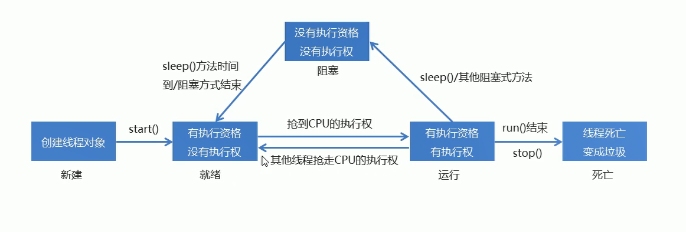

# 

## 网络编程

### InterAdderss类   的使用

String InetAddress getByName(String host)                 //确定主机名称的IP地址                          		String getHostName()                                                      //获取IP地址中的主机名                                                    String getHostAdress()									 //返回文本显示的IP地址字符串

 

## 实现多 线程

##### 进程：正在进行的应用程序

##### 线程：一个进程中的单个顺序控制流。是一个执行路径

单线程：一个进程中只有一条执行路径

多线程：一个进程中有 多个执行路径

##### 多线程实现方式1

继承Thread类，定义一个类MyThread继承Thread类，创建MyThread类中重新写run()方法，启动线程

##### 设置和获取多线程名称

设置名称：setName()

获取名称：getName() 

```java
//方法
public  class MyThreadDemo{
    public static void main(String[] args){
        MyThread my1 =new MyThread();
        MyThread my2 =new MyThread();
        
        my1.setName("风机");
        my2.setName("大炮");
        
        my1.start();
        my2.start();
    }
}
```

  

```java
//方法2
public  class MyThreadDemo{
    public static void main(String[] args){
        MyThread my1 =new MyThread("风机");
        MyThread my2 =new MyThread("大炮");
            
        my1.start();
        my2.start();
    }
}
```

#####  线程调度

分时调度模型：所有线程轮流使用cpu的使用权，平均分配使用权

抢占式调度模型：优先让优先级高的线程使用CPU，如果线程的优先级相同，那么就会随机选择，优先级高的线程获取的时间更长

JAVA使用的是抢占式调度模型

```java
public final int getPriority()  //返回此线程的优先级
public final void setPriority(int newPriority) 
```

优先级的范围是：1~10  默认值是5

```java
//设置优先级
my1.setPriority(5);
```

##### 线程控制

```java
static void sleep(long millis)
//使用当前正在执行的线程停留指定的毫秒数
void join() 
//等待这个线程死亡
void setDaemon(boolean on)
//标记此线程为守护线程，当运行的线程都是守护线程的时候，java虚拟机退出     
```

#####   线程的生命周期



##### 实现Runable接口的方式(多线程的实现方式2)

1.定义一个类MyRunable实现Runable接口

2.在MyRunable类中重写run()方法

3.创建MyRunbale类的对象

4.创建Thread类的对象，把MyRunable对象作为构造方法的参数

5.启动线程