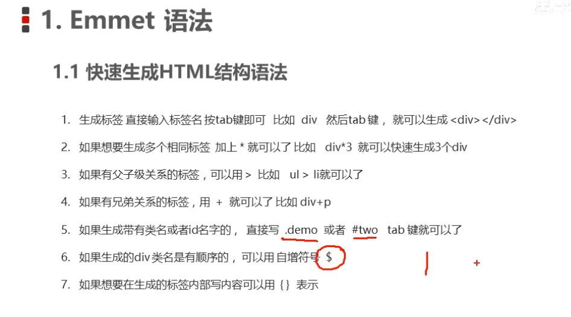

# HTML

HTML是一种超文本标记语言

## 1.web标准

web标准是由W3C组织和其他的标配化组织制定的一系列标准

### web标准的构成

主要包括结构(HTML)，表现(CSS)和行为(JAVASCRIPT)

web标准等待最佳方案：结构，样式，表现相分离

## 2.web的语法规范

1.标签一般都是成对存在，当时也会有但标签

2.html标签是由尖括号所包围的关键词

```html
<html></html>
</br>
```

3.包含关系

```html
<head>
    <title></title>
</head>
```

4.并列关系

```html
<head></head>
<title></title>
```

## 3.HTMl的基本结构标签

```html
<html>
<head>
    <title>第一个页面</title>
    <body>
       	HELLO WORLD!
    </body>
</head>
</html>
```


##  4.网页开发工具

### 1.文档类型声明标签

<!DOCTYPE> 文档类型声明标签，作用就是告诉浏览器用那种类型的HTML版本来显示网页

### 2.lang语言种类

用来定义当前文档显示的语言。

1.en定义语言为英语

2.zh-CN定义语言为中文

简单来说，定义为en就是英文网页，定义为zh-CN就是中文网页其实对于文档显示来说，定义成en的文档也可以显示中文，定义成zh-CN的文档也可以显示英文

```html
<html lang="zh-CN">
</html>
```

### 3.字符集

字符集（Character set）是多个字符的集合。以便计算机能够识别和存储各种文字。

在<head>标签内，可以通过<meta>标签的charset属性来规定HTML文档应该使用哪种字符编码。

```html
<meta charset="UTF-8"/>
```

charset常用的值有：GB2312、BIG5、GBK和UTF-8，其中UTF-8也被称为万国码，基本包含了全世界所有国家需要用到的字符.

charset常用的值有：GB2312、BIG5、GBK和UTF-8，其中UTF-8也被称为万国码，基本包含了全世界所有国家需要用到的字符.

### 4.总结

1.以上三个代码vscode 自动生成，基本不需要我们重写

2.<！DOCTYPE htm1>文档类型声明标签，告诉浏览器这个页面采取htm15版本来显示页面

3.<html lang="en">告诉浏览器或者搜索引擎这是一个英文网站，本页面采取英文来显示

4.<meta charset=\UTF-8"/>必须写.采取UTF-8来保存文字。如果不写就会乱码.具体原理后面分析

## 5.HTML常用标签

### 1.标签语义

学习标签是有技巧的，重点是记住每个标签的语义。简单理解就是指标签的含义，即这个标签是用来干嘛的。

根据标签的语义，在合适的地方给一个最为合理的标签，可以让页面结构更清晰。

### 2.标题标签<h1> - <h6>

为了使网页更具有语义化，我们经常会在页面中用到标题标签。HTML提供了6个等级的网页标题

```html
<h1>我是一级标题</h1>
```

单词head的缩写，意为头部、标题。

标签语义：作为标题使用，并且依据重要性递减。

特点：
1.加了标题的文字会变的加粗，字号也会依次变大。
2.一个标题独占一行。

```html
<h1>标题标签</h1>
<h1>标题一共六级选，</h1>
<h2>文字加粗一行显。</h2>
<h3>由大到小依次减，</h3>
<h4>从重到轻随之变。</h4>
<h5>语法规范书写后，</h5>
<h6>具体效果刷新见。</h6>
```

### 3.段落标签

在网页中，要把文字有条理地显示出来，就需要将这些文字分段显示。在HTML标签中，<p>标签用于定义段落，它可以将整个网页分为若干个段落。

```html
<p>我是一个段落标签</p>
```

标签语义：可以把HTML文档分割为若干段落。

特点：
1.文本在一个段落中会根据浏览器窗口的大小自动换行。
2.段落和段落之间保有空隙。

### 4.换行标签

```html
</br>b
```

用来换行

### 5.例子

```html
<!DOCTYPE html>
<html lang="en">
<head>
    <meta charset="UTF-8">
    <meta name="viewport" content="width=device-width, initial-scale=1.0">
    <title>Document</title>
</head>
<body>
    <h1>水花61分伊戈达拉制胜抢断西决勇士再胜开拓者总分2-0</h1>
	<h4>数据统计：水花兄弟合砍61分</h4>
	<p>库里22投11中，三分14投4中，罚球11罚全中得到37分8篮板8助攻，职业生涯季后赛得分30+次数来到35次，超过哈登			排名现役第3位，仅次于詹姆斯和杜兰特。</p>
	<p>汤普森22投8中，三分8投4中得到24分3篮板2助攻，德拉蒙德-格林得到16分10篮板7助攻5盖帽，凯文-鲁尼得到14分7篮板2助攻，今天勇士有7名替补出场。</p>
	<h4>兄弟对决升级：小库里给哥哥造成压力</h4>
	<p>库里兄弟是NBA历史上第一对在分区决赛相遇的兄弟。在西决第1场中，小库里没有给哥哥造成压力，他出场19分钟，7投1中只得到3分3篮板2助攻，在场期间输掉10分。</p>
<p>但在西决第2场中，小库里攻防两端都打出杰出的表现，全场送出4次抢断，包括直接抢断自己的哥哥库里，在防守端给库里造成了极大的困扰。</p>
</body>
</html>
```

### 6.文本格式化标签

在网页中，有时需要为文字设置粗体、斜体或下划线等效果，这时就需要用到HTML中的文本格式化标签，使文字以特殊的方式显示。

标签语义：突出重要性，比普通文字更重要。
语义标签说明

加粗

```html
|<strong></strong>
```

或者

```
<b></b>
```

更推荐使用<strong>标签加粗语义更强烈

倾斜

```html
<em></em>
```

或者

```html
<i></i>
```

更推荐使用<em>标签加粗语义更强烈

删除线

```html
<del></del>
或者
<s></s>
```

更推荐使用<del>标签加粗语义更强烈

下划线

```html
<ins></ins>
或者
<u></u>
```

更推荐使用<ins>标签加粗语义更强烈

### 7. <div 标签 和< span 标签

是没有语义的，它们就是一个蠢子，用来装内容的。

```html
<div>这是头部</div>
<span>今日价格</span>
```

div是division的缩写，表示分割、分区。span 意为跨度、跨距。

特点：

div 标签用来布局，但是现在一行只能放一个

span 标签用来布局，一行上可以多个

### 8.图像标签和路径

标签用于定义HTML页面中的图像。

```html

```

单词 image的缩写，意为图像。

src是标签的必须属性，它用于指定图像文件的路径和文件名。

所调属性：简单理解就是属于这个图像标签的特性。

属性：

1.src  图片路径

2.alt  替换文本，图片无法显示时显示文本

3.title 提示文本，鼠标上放会有提示

4.width 设置图像的大小

5.height 设置图像的高度

6.border 设置边框

```html

```

### 9.图像标签和路径

#### 1.图像标签

图像标签属性注意点：

1.图像标签可以拥有多个属性，必须写在标签名的后面。

2.属性之间不分先后顺序，标签名与属性、属性与属性之间均以空格分开

3.属性采取键值对的格式，即key="“value”的格式，属性=“属性值”。

#### 2.路径

目录文件夹和根目录：

实际工作中，我们的文件不能随便乱放，否则用起来很难快速的找到他们，因此我们需要一个文件夹来管理他们。

目录文件夹：就是普通文件夹，里面只不过存放了我们做页面所需要的相关素材，比如html文件、图片等。

根目录：打开目录文件夹的第一层就是根目录

相对路径:以引用文件所在位置为参考基础，而建立出的目录路径。这里简单来说，图片相对于HTML页面的位置

同一级路径：图像文件位于HTML的同一级如

```html

```

下一级路径： /  图像位于HTML文件的下一级 

```html

```

上一级路径： ../  图像文件位于HTML文件上一级

```html

```

绝对路径：是指目录下的绝对位置，直接到达目标位置，通常从盘符开始的路径

### 10.超链接

HTML中<a>表示超链接

href 链接目标

target  打开方式吗，_self为默认值 ，__blank为在新窗口打开

```html
<a href="目标" target="_self" ></a>
```

锚点链接：点击链接快速到达页面的某个位置

在链接文本的href 属性中，设置属性值为#名字的形式

找到目标位置标签，里面添加一个id属性=刚才的名字

```html
<a href=“#wo”>第2集</a>
<h3 id="two">第2集介绍</h3>
```

## 6.HTML的注释标签和字符

```html
<!-- 注释 --!>
```

 特殊字符


## 7.表格标签

### 1.表格的主要作用

表格主要用于显示、展示数据，因为它可以让数据显示的非常的规整，可读性非常好。特别是后台展示数据的时候，能够熟练运用表格就显得很重要。一个清爽简约的表格能够把繁杂的数据表现得很有条理。

### 2.表格的基本语法

```html
<table>    //表格
    <tr>   //行
        <td></td>   //格
    </tr>
</table>
```

1.<table></table>是用于定义未格的标签。

2.<tr></tr>标签用于定义表格中的行，必须嵌套在<table></table>标签中。

3.<td></td>用于定义表格中的单元格，必须嵌套在<tr></tr>标签中。

4.字母td指表格数据（table data），即数据单元格的内容。 

### 3.表头单元格标签

一般表头单元格位于表格的第一行或第一列，表头单元格里面的文本内容加粗居中显示<th 标签表示HTML表格的表头部分（table head的缩写）

```html
<table>    //表格
    <tr>
        <th></th>  //表头单元格
    </tr>
    <tr>   //行
        <td></td>   //格
    </tr>
</table>
```

### 4.表格属性


| 属性名      | 属性值              | 描述                                             |
| ----------- | ------------------- | ------------------------------------------------ |
| align       | left、center、right | 规定表格相对周围元素的对齐方式。                 |
| border      | 1或” ”              | 规定表格单元是否拥有边框，默认为""，表示没有边框 |
| cellpadding | 像素值              | 规定单元边沿与其内容之间的空白，默认1像素。      |
| cellspacing | 像素值              | 规定单元格之间的空白，默认2像素.                 |
| width       | 像素值或百分比      | 规定表格的宽度。                                 |

### 5.表格结构标签

使用场景：因为表格可能很长，为了更好的表示表格的语义，可以将表格分割成表格头部和表格主体两大部分.

在表格标签中，分别用：<thead>标签表格的头部区域、<tbody>标签表格的主体区域，这样可以更好的分清表格结构。

### 6.合并单元格

#### 1.跨行合并

rowspan="合并单元格的个数"

#### 2.跨列合并

colspan="合并单元格的个数"

#### 3.目标单元格

跨行：最上侧单元格为目标单元格，写合并代码跨列：最左侧单元格为目标单元格，写合并代码

#### 4.合并

1.先确定是跨行还是跨列合并。

2.找到目标单元格。写上合并方式=合并的单元格数量。比如：<tdcolspan=“2"></td>。

3.删除多余的单元格。

 

```html
<table>
    <tr>
        <td></td>
        <td colspan="2"></td>
    </tr>
    <tr>
        <td></td>
        <td></td>
        <td></td>
    </tr>
    <tr>
        <td rowspan="2"></td>
        <td></td>
        <td></td>
    </tr>
    <tr>
        <td></td>
        <td></td>
    </tr>
</table>
```

## 2.列表标签

表格是用来显示数据的，那么列表就是用来布局的。

列表最大的特点就是整齐、整洁、有序，它作为布局会更加自由和方便。

根据使用情景不同，列表可以分为三大类：无序列表、有序列表和自定义列表。

#### 1.无序列表

ul 标签表示HTML页面中项目的无序列表，一般会以项目符号呈现列表项，而列表项使用 li 标签定义。

```html
<ul>
<1i>列表项1</1i>
<1i>列表项2</1i>
<1i>列表项3</1i>
</ul>
```

1.无序列表的各个列表项之间没有顺序级别之分，是并列的。

2.<ul></ul>中只能嵌套<li></li>，直接在<ul></ul>标签中输入其他标签或者文字的做法是不被允许的。

3.<li>与</i>之间相当于一个容器，可以容纳所有元素。

4.无序列表会带有自己的样式属性，但在实际使用时，我们会使用CSS来设置。

### 2.有序列表

有序列表即为有排列顺序的列表，其各个列表项会按照一定的顺序排列定义。

在HTML标签中，<ol>标签用于定义有序列表，列表排序以数字来显示，并且使用<li>标签来定义列表项。

有序列表的基本语法格式如下：

```html
<o1>
<1i>列表项1</1i>
<1i>列表项2</1i>
<1i>列表项3</1i>
</o1>
```

#### 3.自定义列表

在HTML标签中，<dl>标签用于定义描述列表（或定义列表），该标签会与<dt>（定义项目/名字）和
<dd>（描述每一个项目/名字）一起使用。

```html
<dl>
    <dt>名词</dt>
    <dd>解释1</dd>
    <dd>解释2</dd>
</dl>
```


## 8.表单标签

### 1.表单

用于收集用户信息，与用户进行交互

### 2.表单的组成

在HTML中，一个完整的表单通常由表单域、表单控件（也称为表单元素）和提示信息3个部分构成。

### 3.表单域

表单域是一个包含表单元素的区域。
在HTML标签中，<form>标签用于定义表单域，以实现用户信息的收集和传递。

from 会把它范围内的表单元素信息提交给服务器。

```html
<form actin="demo.php" method="POST" name="name1">
</form>
```

### 3.表单元素

#### 1.input 表单元素

| 属性值   | 描述                                                         |
| -------- | ------------------------------------------------------------ |
| button   | 定义输入字段和“浏览”按钮，供文件上传                         |
| checkbox | 定义复选框。                                                 |
| file     | 定义输入字段和“浏览”按钮，供文件上传。                       |
| hidden   | 定义隐藏的输入字段。                                         |
| image    | 定义图像影式的提交按钮。                                     |
| password | 定义密码字段。该字段中的字符被掩码。                         |
| radio    | 定义单选按钮。                                               |
| reset    | 定义重置按钮。重置按钮会清除表单中的所有数据。               |
| submit   | 定义提交按钮。提交按钮会把表单数据发送到服务器。             |
| text     | 定义单行的输入字段，用户可在其中输入文本。默认宽度为20个字符。 |

####   2.要点

name属性：当前input表单的名字，后台可以通过这个name属性找到这个表单。页面中的表单很多，name的主要作用就是用于区别不同的表单。

```html
用户名：<input type="text"value="请输入用户名"name="username"/>
```

name属性后面的值，是自定义的
radio（或者checkbox）如果是一组，我们必须给他们命名相同的名字

```html
<input type="radio"name="sex"/>男
<input type="radio"name="sex"/>女
```

checked属性：表示默认选中状态。用于单选按钮和复选按钮。

```html
<input type="radio"name="sex"value="男"checked="checked"/>男
<input type="radio"name="sex"value="女"/妆
```

type属性：type属性可以让input表单元素设置不同的形态。

```html
<input type="radio"name="sex"value="男"checked="checked"/>男
<input type="text"value=请输入用户名">

```

#### 4.type其他属性

| 属性值   | 描述                                                         |
| -------- | ------------------------------------------------------------ |
| button   | 定义可点击按钮（多数情况下，用于通过JavaScript启动脚本）     |
| checkbox | 定义复选框                                                   |
| file     | 定义输入字段和“浏览”按钮，供文件上传                         |
| hidden   | 定义隐藏的输入字段                                           |
| image    | 定义图像形式的提交按钮                                       |
| password | 定义密码字段。该字段中的字符被掩码                           |
| radio    | 定义单选按钮                                                 |
| reset    | 定义重置按钮。重置按钮会清除表单中的所有数据                 |
| submit   | 定义提交按钮。提交按钮会把表单数据发送到服务器               |
| text     | 定义单行的输入字段，用户可在其中输入文本。默认宽度为20个字符 |

#### label 标签

<label>标签为input元素定义标注（标签）。

<label>标签用于绑定一个表单元素，当点击<label>标签内的文本时，浏览器就会自动将焦点（光标转到或者
选择对应的表单元素上，用来增加用户体验.

```html
<label for="sex">男</1abe1>
<input type="radio" name="sex"id="sex"/>
```

核心：<label>标签的for 属性应当与相关元素的id属性相同。

# css

## 1.css的选择器

### 1.css派生选择器

```css
li strong {
    font-style: italic;
    font-weight: normal;
  }

<p><strong>我是粗体字，不是斜体字，因为我不在列表当中，所以这个规则对我不起作用</strong></p>

<ol>
<li><strong>我是斜体字。这是因为 strong 元素位于 li 元素内。</strong></li>
<li>我是正常的字体。</li>
</ol>
```

### 2.id选择器

id 选择器可以为标有特定 id 的 HTML 元素指定特定的样式。

id 选择器以 "#" 来定义。

```css
#red {color:red;}
#green {color:green;}
```

```html
<p id="red">这个段落是红色。</p>
<p id="green">这个段落是绿色。</p>
```

id选择器和派生选择器

```css
#sidebar p {
	font-style: italic;
	text-align: right;
	margin-top: 0.5em;
	}

#sidebar h2 {
	font-size: 1em;
	font-weight: normal;
	font-style: italic;
	margin: 0;
	line-height: 1.5;
	text-align: right;
	}
```

### 3.类选择器

在 CSS 中，类选择器以一个点号显示

```css
.center {text-align: center}
```

```html
<h1 class="center">
This heading will be center-aligned
</h1>

<p class="center">
This paragraph will also be center-aligned.
</p>
```

也可以用于派生选择器，不再赘叙

多类名使用

```html
<div class="red font20">亚瑟</div>
```

（1）在标签class属性中写多个类名

（2）多个类名中间必须用空格分开

（3）这个标签就可以分别具有这些类名的样式

#### 4.属性选择

对带有指定属性的 HTML 元素设置样式。
可以为拥有指定属性的 HTML 元素设置样式，而不仅限于 class 和 id 属性。

下面的例子为带有 title 属性的所有元素设置样式：

```css
[title]
{
color:red;
}
```

下面的例子为 title="W3School" 的所有元素设置样式：

```css
[title=W3School]
{
border:5px solid blue;
}
```

## 2.css字体属性

### 1.字体系列

#### 1.通用字体系列

如果你希望文档使用一种 sans-serif 字体，但是你并不关心是哪一种字体，以下就是一个合适的声明：

```css
body {font-family: sans-serif;}
```

除了使用通用的字体系列，您还可以通过 font-family 属性设置更具体的字体。

```css
h1 {font-family: Georgia;}
```

#### 2.非通用字体系列 

如果用户代理上没有安装 Georgia 字体，就只能使用用户代理的默认字体来显示 h1 元素。

我们可以通过结合特定字体名和通用字体系列来解决这个问题：

```css
h1 {font-family: Georgia, serif;}
```

### 2.字体大小

CSS使用font-size属性定义字体大小。

```css
p{
    font-size: 10px;
}
```

px（像素）大小是我们网页的最常用的单位

谷歌浏览器默认的文字大小为16px

不同浏览器可能默认显示的字号大小不一致，我们尽量给一个明确值大小，不要默认大小

可以给body指定整个页面文字的大小

### 3.字体风格

font-style 属性最常用于规定斜体文本

该属性有三个值：

- normal - 文本正常显示
- italic - 文本斜体显示
- oblique - 文本倾斜显示

```css
p.normal {font-style:normal;}
p.italic {font-style:italic;}
p.oblique {font-style:oblique;}
```

font-weight 属性设置文本的粗细。

使用 bold 关键字可以将文本设置为粗体。

关键字 100 ~ 900 为字体指定了 9 级加粗度。如果一个字体内置了这些加粗级别，那么这些数字就直接映射到预定义的级别，100 对应最细的字体变形，900 对应最粗的字体变形。数字 400 等价于 normal，而 700 等价于 bold。

```css
p.normal {font-weight:normal;}
p.thick {font-weight:bold;}
p.thicker {font-weight:900;}
```

### 4.字体复合属性

将字体的所有属性一行写完

```css
body{
font:font-style font-weight font-size/line-height font-family;
}
```

使用font 属性时，必须按上面语法格式中的顺序书写，不能更换顺序，并且各个属性间以空格隔开

font-size 和 font-family 不可以省略

## 3.css文本属性

### 1.文本颜色 

color属性用于定义文本的颜色

```css
div{
    color :red;
    color #ff0000:
}
```

### 2.对齐文本

text-align属性用于设置元素内文本内容的水平对齐方式

```css
div{
    text-align:center;
}
```

left :左对齐

right:右对齐

center:居中对齐

### 3.装饰文本

text-decoration属性规定添加到文本的修饰。可以给文本添加下划线、删除线、上划线等。

```css
div{
    text-decoration :underline;
}
```

none:默认 没有装饰

underline: 下划线

overline: 上划线

line-through:删除线 

### 4.文本缩进

text-indent属性用力啊指定文本的第一行的缩进，通常是将段落的首行进行缩进

```css
div{
    text-indent: 10px；
}
```

em是一个相对单位，就是当前元素（font-size）1个文字的大小如果当前元素没有设置大小，则会按照父元素的1个文字大小。

```css
p{
    text-indent: 2em;
}
```

### 5.行间距

line-height属性用于设置行间的距离（行高）。回以控制这字行与行之面的距离

```css
p{
    ling-height: 10px ;
}
```

## 4.css的引入方式

### 1.内部样式表

内部样式表（内嵌样式表）是写到html页面内部.是将所有的CSS代码抽取出来，单独放到一个<style>标签中。

```css
<style>
div{
    color :red;
    font-size:12px;
}
</style>
```

<style  标签理论上可以放在HTML文档的任何地方，但一般会放在文档的<head 标签中

通过此种方式，可以方便控制当前整个页面中的元素样式设置

代码结构清晰，但是并没有实现结构与样式完全分离

使用内部样式表设定CSS，通常也被称为==嵌入式==引入，这种方式是我们练习时常用的方式

#### 2.行内样式表

行内样式表（内联样式表）是在元素标签内部的style属性中设定CSS样式。适合于修改简单样式

```css
<p style="color : red" ></p>
```

### 3.外部样式表

实际开发都是外部样式表.适合于样式比较多的情况.核心是样式单独写到CSS文件中，之后把CSS文件引入到HTML页面中使用。

步骤：

1.新建一个后缀名为.css的样式文件，把所有CSS代码都放入此文件中。
2.在HTML页面中，使用<link>标签引入这个文件。

```css
<link rel="stylesheet href="xxx.css" >
```



## 5.css的复合选择器

### 1.后代选择器 

```css
ol li{
    color: red;
}
```

### 2.子元素选择器(只选择儿子)

```css
.nav>li{
    color:red;
}
```

### 3.并集选择器

```css
div ,
p,
li{
    color :pink;
}
```

### 4.链接伪类选择器

 ```css
a:link   //选择所有未访问的链接
a:visited  //选择所有已访问的链接
a:hover	 //选择鼠标指针位于其上的链接
a:active  //选择活动链接
 ```

```css
a:link{
    color :red;
}
a:visited{
    color:black;
}
a:hover{
    color:skyblue;
}
a:active{
    color:green;
}
```

注意事项：顺序必须按照 link visited hover active  ==LVHA==

### 5.focus伪类选择器

:focus伪类选择器用于选取获得焦点的表单元素

焦点就是光标，一般情况<input>类表单元素才能获取，因此这个选择器也主要针对表单元素来说

```css
input:focus{
    background-color:yellow
}
```

鼠标点哪，哪里就是获得光标

## 6.css的元素显示模式

### 1.什么是元素的显示模式

作用：网页标签较多，在不同的地方会用到不同类型的标签，了解他们的特点可以更好的布局我们的网页 

HTML分为块元素和行内元素两种类型

一个div为一行一个span为一块

### 2.块元素

常见的块元素有<h1>~<h6>、<p>、<div>、<ul>、< ol>、<li>等，其中<div>标签是最典型的块元素。

块级元素的特点：
①比较霸道，自己独占一行。
②高度，宽度、外边距及内边距都可以控制。③宽度默认是容器（父级宽度）的100%。
④是一个容器及盒子，里面可以放行内或者块级元素。

文字类的元素内不能用块级元素

### 3.行内元素

常见的行内元素有<a>、<strong>、<b>、<em>、<i>、<del>、<s>、<ins>、<u>、<span>等，其中<span>标签是最典型的行内元素。

有的地方也将行内元素称为内联元素。
行内元素的特点：

①相邻行内元素在一行上，一行可以显示多个。
②高、宽直接设置是无效的。
③默认宽度就是它本身内容的宽度。
④行内元素只能容纳文本或其他行内元素。<a> 可以放块级

### 4.行内块元素

在行内元素中有几个特殊的标签—、<input/>、<td>，它们同时具有块元素和行内元素的特点。
有些资料称它们为行内块元素。
行内块元素的特点：
①和相邻行内元素（行内块）在一行上，但是他们之间会有空白缝隙。一行可以显示多个（行内元素特点）。
②默认宽度就是它本身内容的度（行内元素特点）。
③高度，行高、外边距以及内边距都可以控制（块级元素特点）。 

### 行块元素

```css
div{
    display:inline //行内元素
    display:block; //块元素
    display: inline-block //行内块元素 
}
```

### 5.垂直居中

使文字垂直居中的方法：让文字的行高等于标签的高度

## 7.css的背景

### 1.背景颜色

background-color 属性定义了元素的背景颜色

```css
background-color: 颜色
```

一般情况下元素颜色默认为transparent(透明)，我们也可以手动指定背景颜色为透明色

### 2.背景图片

background-image 属性描述了元素的背景图像。实际开发常见于logo或者一些装饰性的小图片或者是超大的背景图片，优点是非常便于控制位置（精灵图也是一种运用场景）

```css
background-image: url(src)
```

不写url默认无图片

### 3.背景平铺

如果需要在HTML页面上对背景图像进行平铺，可以使用background-repeat属性。

```css
background-repeat:repeat |no-repeat |repeat-x |repeat-y
```


repeat：背景图像在纵向和横向上平铺
no-repeat：背景图像不平铺
repeat-x：背景图像在横向上平铺
repeat-y：背景图像在纵向平铺

### 4.背景图片位置  

利用background-position属性可以改变图片在背景中的位置。

```css
background-position:x y；
```

参数代表的意思是：x坐标和y坐标。可以使用方位名词或者精确单位参数值说明

length百分数|由浮点数字和单位标识符组成的长度值

position 															top I center | bottom I left I center |right 方位名词

#### 1.参数是方位名词

如果指定的两个值都是方位名词，则两个值前后顺序无关，比如left top和top left效果一致

如果只指定了一个方位名词，另一个值省略，则第二个值默认居中对齐

##### 1.超大背景图片

```css
body{
    background-image:url(images/bd.jpg);
    backgrounp-repeat:no-repeat;
    backgrounp-position:center top;
}
```

#### 2.参数是精确单位

如果参数值是精确坐标，那么第一个肯定是x坐标，第二个一定是y坐标

如果只指定一个数值，那该数值一定是x坐标，另一个默认垂直居中

#### 3.参数是混合单位

如果指定的两个值是精确单位和方位名词混合使用，则第一个值是x坐标，第二个值是y坐标

### 5.背景图像固定(背景附着)

background-attachment 属性设置背景图像是否固定或者随着页面的其余部分滚动。

background-attachment后期可以制作视差滚动的效果。

```css
background-attachment:scroll l fixed
```

scroll 背景图像是随着对象内容滚动（默认）

fixed 背景图像固定

### 6.背景复合写法

为了简化背景属性的代码，我们可以将这些属性合并简写在同一个属性background中。从而节约代码量当使用简写属性时，没有特定的书写顺序，一般习惯约定顺序为：

==background：背景颜色背景图片地址背景平铺背景图像滚动背景图片位置；==

```css
background:transparent url（image.jpg）repeat-y fixed top；
```

这是实际开发中，我们更提倡的写法。

### 7.背景色半透明

CSS3为我们提供了背景颜色半透明的效果。

```css
background:rgba（0，0，0，0.3）；
```

最后一个参数是alpha透明度，取值范围在0~1之间

我们习惯把0.3的0省略掉，写为background:rgba（0，0，0，.3）；

注意：背景半透明是指盒子背景半透明，盒子里面的内容不受影响 

## 8.css的三大特性

### 1.层叠性

相同选择器给设置相同的样式，此时一个样式就会覆盖（层叠）另一个冲突的样式。层叠性主要解决样式冲突的问题

样式冲突，遵循的原则是就近原则，哪个样式离结构近，就执行哪个样式

样式不冲突，不会层叠

### 2.继承性

现实中的继承：我们继承了父亲的姓

CSS中的继承：子标签会继承父标签的某些样式，如文本颜色和字号。简单的理解就是：子承父业。

#### 1行高的继承性

```css
body{
    font:12px/1.5 Microsoft YaHei；
}
```

子元素没有设置行高，则会继承父元素的行高为1.5

此时子元素的行高是：当前子元素的文字大小*1.5

body行高1.5这样写法最大的优势就是里面子元素可以根据自己文字大小自动调整行高

### 3.优先级

当同一个元素指定多个选择器，就会有优先级的产生。

选择器相同，则执行层叠性

选择器不同，则根据选择器权重执行

important>行内样式 style="">ID选择器>类选择器，伪选择器>元素选择器>继承或者*

## 9.盒子模型

### 1.网页布局

1.先准备好相关的网页元素，网页元素基本都是盒子Box。

2.利用CSS设置好盒子样式，然后摆放到相应位置。

### 2.盒子模型的组成

所谓盒子模型：就是把HTML页面中的布局元素看作是一个矩形的盒子，也就是一个盛装内容的容器。
CSS 盒子模型本质上是一个盒子，封装周围的HTML元素，它包括：边框、外边距、内边距、和实际内容

border：边框

content：内容

padding：内容与边框的距离，内边距

margin：盒子之间的距离，外边距

### 3.边框（border）

border可以设置元素的边框。边框有三部分组成：==边框宽度（粗细），边框样式，边框颜色==

```css
border:border-width || border-style|| border-color
```

border-width  定义边框粗细，单位是px

```CSS
{
    border-width:1px;
}
```


border-style 边框的样式

```css
a{
    border-style:solid 实线边框;
    border-style:dashed虚线边框; 		border-style:dotted点线边框
}
```

border-color 边框颜色

```CSS
{
    BORDER-COLOR:PINK;
}
```

边框的简写方式

每个属性之间没有顺序

```css
{
    border:5px solid red;
}
```

边框拆开写

上 border-top；下 border-bottom；左 border-left； 右 border-right

border-collapse 合并边框

```css
border-collapse:collaspe;
```

### 4.边框会影响盒子实际大小

边框会额外增加盒子的实际大小。因此我们有两种方案解决：

1.测量盒子大小的时候不量边框.
2.如果测量的时候包含了边框，则需要width/height减去边框宽度

### 4.内边距（padding）

盒子边框与盒子内容的距离

上 padding-top；下 padding-bottom；左 padding-left； 右padding-right；

复合型写法

```css
{
    padding:5px; //上下左右
}

{
    padding:5px 10px;//上下 左右
}

{
    padding:5px 10px 20px;//上 左右 下
}

{
    padding:5px 10px 20px 30px;//上右下左
}
```

当我们给盒子指定padding值之后，发生了2件事情：

1.内容和边框有了距离，添加了内边距。
2.padding影响了盒子实际大小。
也就是说，如果盒子已经有了宽度和高度，此时再指定内边框，会撑大盒子。

### 5.外边距（margin）

上 margin-top；下 margin-bottom；左 margin-left；右 margin-right；

#### 1.外边距的典型应用

 外边距可以让块级盒子水平居中，但是必须满足两个条件：

①盒子必须指定了宽度（width）。

②盒子左右的外边距都设置为auto。

```css
.header{width：960px；margin：0 auto；}
```

```css
margin-left:auto；
margin-right: auto；
margin:auto；
margin:O auto；
```

#### 2.外边距塌陷问题

对于两个嵌套关系（父子关系）的块元素，父元素有上外边距同时子元素也有上外边距，此时父元素会塌陷较大的外边距值。

解决办法

①可以为父元素定义上边框。							②可以为父元素定义上内边距。|内容区域
③可以为父元素添加overflow:hidden。
还有其他方法，比如浮动、固定，绝对定位的盒子不会有塌陷问题，后面咱们再总结。

### 4.消除内外边距的

网页元素很多都带有默认的内外边距，而且不同浏览器默认的也不一致。因此我们在布局前，首先要清除下网页元素的内外边距。

```css
*{
  padding :0;
  margin :0;
}
```

行内元素只设置左右内外边距，不要设置上下的内外边距

###  5.圆角边框

在CSS3中，新增了圆角边框样式，这样我们的盒子就可以变圆角了。

border-radius属性用于设置元素的外边框圆角。

```css
border-radius：1ength；
```

radius半径（圆的半径）原理：（椭）圆与边框的交集形成圆角效果

参数值可以为数值或百分比的形式

如果是正方形，想要设置为一个圆，把数值修改为高度或者宽度的一半即可，或者直接写为50%

如果是个矩形，设置为高度的一半就可以做新人福利

该属性是一个简写属性，可以跟四个值，分别代表左上角、右上角、右下角、左下角

分开写：border-top-left-radius、border-top-right-radius、border-bottom-right-radius和border-bottom-left adius

### 6.盒子阴影

CSS3中新增了盒子阴影，我们可以使用box-shadow属性为盒子添加阴影。

语法：

```css
box-shadow:h-shadow v-shadow blur spread color inset；
```

h-shadow 必需。水平阴影的位置。允许负值。

v-shadow 必需。垂直阴影的位置。允许负值。

blur 可选。模糊距离。

spread 可选。阴影的尺寸。

color 可选。阴影的颜色。请参阅CSS颜色值。

inset 可选。将外部阴影（outset）改为内部阴影。

好看的影子

```css
box-shadow：10px 10px 10px-4px rgba（0，0，0，.3）；
```

### 7.文本阴影

在CSS3中，我们可以使用text-shadow属性将阴影应用于文本。

语法：

```css
text-shadow:h-shadow v-shadow blur color；
```


值描述
h-shadow 必需。水平阴影的位置。允许负值。
v-shadow 必需。垂直阴影的位置。允许负值。
blur 可选。模糊的距离。
color 可选。阴影的颜色。参阅CSS额色值。